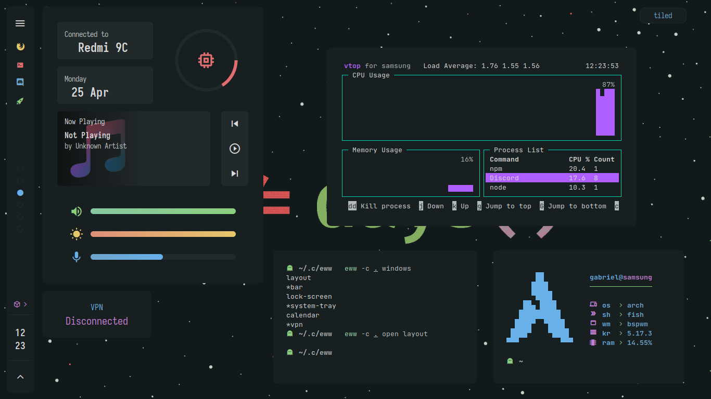

# Eww Dotfiles!

```sh
eww-dotfiles-launcher start-component README.md --comment "Eww Dotfiles!"
```

This is my eww dotfiles repository, in this moment am using [Everblush](https://github.com/Everblush)
by [Mangeshrex](https://github.com/Mangeshrex) but i'll add more themes (like night and levuaska)



## Requirements

- JetBrainsMono Nerd Font
- Iosevka Nerd Font
- eww
- bspwm
- sxhkd
- rofi
- dunst
- st (see [st config](#st))
- psmisc
- fish
- bat
- exa

> feel free to open an issue specifying more dependencies for ur os, my os is Arch btw :3

## Installation

1. First make sure u have all the [requirements](#requirements) in ur system

2. Clone the repository:

```sh
git clone https://github.com/AlphaTechnolog/eww-dotfiles ~/.eww-dotfiles
cd ~/.eww-dotfiles
```

3. Set `fish` as ur default shell

```sh
sudo usermod --shell $(which fish) $(whoami)
```

4. Copy configs

```sh
pwd
# ~/.eww-dotfiles
cp -r ./config/* ~/.config
cp -r ./bin/* ~/.local/bin
cp -r ./home/* ~/
```

5. Restart and start with `bspwm`

6. Enjoy

## St Config

To make st works, compile it:

```sh
cd ~/.config/st
sudo make clean install
```
